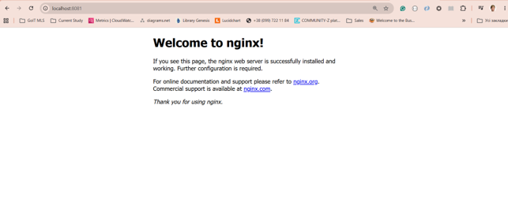

# GoIT MLOps HW-07 – ArgoCD GitOps Deployment

## Overview

This project demonstrates a GitOps deployment workflow using:

- AWS EKS
- Kubernetes
- Terraform
- Helm
- ArgoCD

ArgoCD was deployed into an Amazon EKS cluster using Terraform and Helm. A sample Nginx application was then deployed and managed through ArgoCD.

---

## Project Structure

```text
goit-argo
├── application.yaml
├── README.md
├── screenshots
│   └── nginx.png
└── namespaces
    ├── application
    │   ├── nginx.yaml
    │   └── ns.yaml
    └── infra-tools
        └── ns.yaml
```

---

## Deploy ArgoCD

Navigate to the Terraform configuration:

```bash
cd terraform/argocd
```

Initialize Terraform:

```bash
terraform init
```

Review the deployment plan:

```bash
terraform plan
```

Deploy ArgoCD:

```bash
terraform apply
```

---

## Verify ArgoCD Installation

Check that all ArgoCD components are running:

```bash
kubectl get pods -n infra-tools
```

Example output:

```text
argocd-application-controller
argocd-applicationset-controller
argocd-dex-server
argocd-notifications-controller
argocd-redis
argocd-repo-server
argocd-server
```

---

## Access ArgoCD UI

Start port forwarding:

```bash
kubectl port-forward svc/argocd-server -n infra-tools 9090:80
```

Open in browser:

```text
http://localhost:9090
```

Retrieve the initial admin password:

```powershell
kubectl -n infra-tools get secret argocd-initial-admin-secret -o jsonpath="{.data.password}" | % { [System.Text.Encoding]::UTF8.GetString([System.Convert]::FromBase64String($_)) }
```

Login credentials:

```text
Username: admin
Password: <retrieved-password>
```

---

## Deploy Application with ArgoCD

Apply the ArgoCD Application manifest:

```bash
kubectl apply -f application.yaml
```

Verify application status:

```bash
kubectl get applications -n infra-tools
```

Output:

```text
NAME         SYNC STATUS   HEALTH STATUS
demo-nginx   Synced        Healthy
```

---

## Verify Deployment

Check the running pod:

```bash
kubectl get pods -n application
```

Output:

```text
NAME                           READY   STATUS
demo-nginx-68dbd56dc8-ggg7m    1/1     Running
```

Check the service:

```bash
kubectl get svc -n application
```

Output:

```text
NAME         TYPE        CLUSTER-IP      PORT(S)
demo-nginx   ClusterIP   172.20.71.223   80/TCP
```

---

## Access Nginx

Create a port-forward to the service:

```bash
kubectl port-forward svc/demo-nginx -n application 8081:80
```

Open:

```text
http://localhost:8081
```

---

## Deployment Result

Nginx was successfully deployed and managed by ArgoCD.



---

## Technologies Used

- AWS EKS
- Kubernetes
- Terraform
- Helm
- ArgoCD
- GitHub
- Nginx

---

## Repository

GitHub Repository:

https://github.com/ZoryanaYaremko/goit-argo# goit-argo